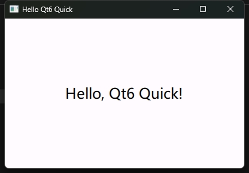
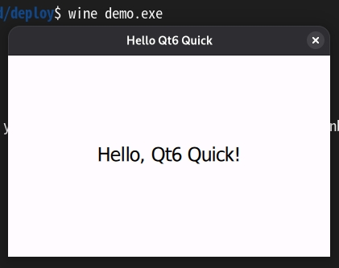

# msys2_mingw64_qt6-quick_deployment

在 msys2 MINGW64 环境下部署 Qt 6 Quick 程序的踩坑记录

## 依赖

```bash
pacman -S \
  mingw-w64-x86_64-gcc \
  mingw-w64-x86_64-make \
  mingw-w64-x86_64-cmake \
  mingw-w64-x86_64-qt6-base \
  mingw-w64-x86_64-qt6-tools \
  mingw-w64-x86_64-qt6-declarative \
  mingw-w64-x86_64-icu
```

### 版本号

`mingw-w64-x86_64-gcc: 15.2.0-9`

`mingw-w64-x86_64-make: 4.4.1-4`

`mingw-w64-x86_64-cmake: 4.2.1-1`

`mingw-w64-x86_64-qt6-base: 6.10.1-3`

`mingw-w64-x86_64-qt6-declarative: 6.10.1-2`

`mingw-w64-x86_64-qt6-tools: 6.10.1-2`

`mingw-w64-x86_64-icu: 78.1-1`


## 坑1

`windeployqt6` 需要使用到 `qmlimportscanner` 等工具来辅助部署依赖，但是这些工具所在的目录：`/mingw64/share/qt6/bin` 默认不在环境变量内，因此执行 `windeployqt6` 时会报错：

`Process failed to start:`

对此就需要额外设置环境变量：

```bash
export PATH="/mingw64/share/qt6/bin:$PATH"
```


## 坑2

将所有的依赖都打包好后，确认 Windows 不会再弹窗提示缺失 DLL 后，双击运行，还是没有任何窗口出现

通过 `dbgview` 获取到 qml debug 打印后，得知是找不到 qml 模块

```bash
00000001	0.00000000	[15232] QQmlApplicationEngine failed to load component	
00000002	0.00002640	[15232] qrc:/qml/demo/main.qml:3:1: module "QtQuick.Controls.Material" is not installed	
00000003	0.00003930	[15232] qrc:/qml/demo/main.qml:2:1: module "QtQuick.Controls" is not installed	
00000004	0.00005160	[15232] qrc:/qml/demo/main.qml:1:1: module "QtQuick" is not installed	
```

这个时候就需要在程序目录下创建配置文件 `qt.conf`，来指定 qml 目录了

```
[Paths]
QmlImports=./qml
Plugins=./
```


## 项目的意义

所以这个项目主要是描述了这个学习的过程，以及提供了一个脚本 `build_deploy.sh` 来实现自动化程序编译构建、文件复制部署

主要就是帮忙复制了以下依赖：

```bash
DLLS=(
    libb2-1.dll
    libbrotlicommon.dll
    libbrotlidec.dll
    libbz2-1.dll
    libdouble-conversion.dll
    libfreetype-6.dll
    libgcc_s_seh-1.dll
    libglib-2.0-0.dll
    libgraphite2.dll
    libharfbuzz-0.dll
    libicudt78.dll
    libicuin78.dll
    libicuuc78.dll
    libiconv-2.dll
    libintl-8.dll
    libmd4c.dll
    libpcre2-16-0.dll
    libpcre2-8-0.dll
    libpng16-16.dll
    libstdc++-6.dll
    libwinpthread-1.dll
    libzstd.dll
    zlib1.dll
)
```

### 编译 demo

在 msys2 MinGW64 环境下

```bash
cd demo
./build_deploy.sh
```


## 测试

`Windows 11 23H2 22631.6199`: ✔️PASS




`Windows 10 1607 14393.187`: ❌FAIL 看起来是调用 `SetThreadDescription` 失败了


`wine 10.0` ✔️PASS（何意味）




## 补充

其实个人并不建议通过 msys2 或者说 MinGW 来在 Windows 下开发

因为根据 [Qt 官方公告](https://doc.qt.io/qt-6/qtwebengine-platform-notes.html)， `Qt WebEngine` 的 MinGW 编译不被支持，万一就用上了呢？

> **Note:** It is not recommended to use tools from `msys2` or `cygwin` to build Qt WebEngine as it may result in build errors.
>
> **Note:** Currently, Qt [WebEngine](https://doc.qt.io/qt-6/qml-qtwebengine-webengine.html) does not compile with MinGW.


## Third-Party Licenses

This software uses the Qt Toolkit under the terms of the GNU Lesser General Public License version 3 (LGPL-3.0).

Qt is Copyright (C) The Qt Company Ltd.

You may obtain the Qt source code from: https://www.qt.io